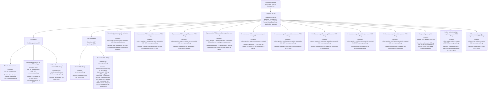

# Community-Acquired Pneumonia (CAP®)
Source: https://www.unboundmedicine.com/ucentral/view/Guidelines%20for%20Antibiotic%20Use/1308079/all/Pneumonia%2C%20CAP

```mermaid
flowchart TD
    N1["Community-Acquired Pneumonia (CAP®) Decision Tree"]
    N2["Diagnosis of CAP<br/><br/>Condition: (cough OR shortness_of_breath OR pleuritic_chest_pain) AND oxygen_requirement AND radiographic_infiltrates"]
    N1 --> N2
    N3["ICU patient<br/><br/>Condition: patient_in_ICU"]
    N2 --> N3
    N4["Risk for Pseudomonas<br/><br/>Condition: risk_for_pseudomonas<br/><br/>Decision: Use Hospital-Acquired Pneumonia (HAP) recommendations"]
    N3 --> N4
    N5["No Pseudomonas risk, no severe PCN allergy<br/><br/>Condition: NOT risk_for_pseudomonas AND NOT severe_pcn_allergy<br/><br/>Decision: Ceftriaxone 1 g IV Q24H PLUS Azithromycin 500 mg IV Q24H"]
    N3 --> N5
    N6["No Pseudomonas risk, severe PCN allergy<br/><br/>Condition: NOT risk_for_pseudomonas AND severe_pcn_allergy<br/><br/>Decision: Moxifloxacin 400 mg IV Q24H"]
    N3 --> N6
    N7["Non-ICU patient<br/><br/>Condition: NOT patient_in_ICU"]
    N2 --> N7
    N8["Severe PCN allergy<br/><br/>Condition: severe_pcn_allergy<br/><br/>Decision: Moxifloxacin 400 mg IV/PO Q24H"]
    N7 --> N8
    N9["No severe PCN allergy<br/><br/>Condition: NOT severe_pcn_allergy<br/><br/>Decision: Ampicillin/sulbactam 1.5 g IV Q6H PLUS (Azithromycin 500 mg IV/PO daily OR Doxycycline 100 mg IV/PO BID) OR Ceftriaxone 1 g IV Q24H PLUS (Azithromycin OR Doxycycline) OR Cefdinir 300 mg PO Q12H PLUS (Azithromycin OR Doxycycline)"]
    N7 --> N9
    N10["Necrotizing pneumonia with cavitation and influenza-like illness<br/><br/>Condition: necrotizing_pneumonia_with_cavitation AND influenza_like_illness<br/><br/>Decision: Add Linezolid 600 mg IV/PO Q12H to above regimen for CA-MRSA coverage"]
    N2 --> N10
    N11["S. pneumoniae PCN susceptible, no severe PCN allergy<br/><br/>Condition: culture_positive_s_pneumoniae_pcn_susceptible AND NOT severe_pcn_allergy<br/><br/>Decision: Penicillin G 1.5 million units IV Q6H OR Amoxicillin 500 mg PO Q8H"]
    N2 --> N11
    N12["S. pneumoniae PCN susceptible, severe PCN allergy<br/><br/>Condition: culture_positive_s_pneumoniae_pcn_susceptible AND severe_pcn_allergy<br/><br/>Decision: Azithromycin OR Moxifloxacin if Erythromycin resistant"]
    N2 --> N12
    N13["S. pneumoniae PCN intermediate or positive urine antigen<br/><br/>Condition: culture_positive_s_pneumoniae_pcn_intermediate OR positive_urine_antigen_s_pneumoniae<br/><br/>Decision: Penicillin G 1.5 million units IV Q6H OR Amoxicillin 1 g PO Q8H (adjust for allergy as above)"]
    N2 --> N13
    N14["S. pneumoniae PCN resistant, cephalosporin susceptible<br/><br/>Condition: culture_positive_s_pneumoniae_pcn_resistant<br/><br/>Decision: Ceftriaxone 1 g IV Q24H OR Cefdinir 300 mg PO Q12H (Moxifloxacin if allergy)"]
    N2 --> N14
    N15["H. influenzae ampicillin susceptible, no severe PCN allergy<br/><br/>Condition: culture_positive_h_influenzae_ampicillin_susceptible AND NOT severe_pcn_allergy<br/><br/>Decision: Ampicillin 1 g IV Q6H OR Amoxicillin 500 mg PO Q8H"]
    N2 --> N15
    N16["H. influenzae ampicillin susceptible, severe PCN allergy<br/><br/>Condition: culture_positive_h_influenzae_ampicillin_susceptible AND severe_pcn_allergy<br/><br/>Decision: Azithromycin OR Cefdinir OR Doxycycline OR Moxifloxacin"]
    N2 --> N16
    N17["H. influenzae ampicillin resistant, no severe PCN allergy<br/><br/>Condition: culture_positive_h_influenzae_ampicillin_resistant AND NOT severe_pcn_allergy<br/><br/>Decision: Ampicillin/sulbactam OR Amoxicillin/clavulanate"]
    N2 --> N17
    N18["H. influenzae ampicillin resistant, severe PCN allergy<br/><br/>Condition: culture_positive_h_influenzae_ampicillin_resistant AND severe_pcn_allergy<br/><br/>Decision: Azithromycin OR Cefdinir OR Doxycycline OR Moxifloxacin"]
    N2 --> N18
    N19["Legionella pneumophila<br/><br/>Condition: positive_urine_antigen_legionella<br/><br/>Decision: Azithromycin 500 mg IV/PO Q24H OR Moxifloxacin 400 mg IV/PO Q24H (adjust duration per allergy)"]
    N2 --> N19
    N20["Culture and urine antigen negative, no severe PCN allergy<br/><br/>Condition: culture_urine_antigen_negative AND NOT severe_pcn_allergy<br/><br/>Decision: Cefdinir 300 mg PO BID OR Amoxicillin/clavulanate XR 2 g PO Q12H"]
    N2 --> N20
    N21["Culture and urine antigen negative, severe PCN allergy<br/><br/>Condition: culture_urine_antigen_negative AND severe_pcn_allergy<br/><br/>Decision: Moxifloxacin 400 mg IV/PO Q24H"]
    N2 --> N21

    %% Styling
    classDef decisionNode fill:#e1f5fe,stroke:#01579b,stroke-width:2px
    classDef leafNode fill:#f3e5f5,stroke:#4a148c,stroke-width:2px
    classDef endNode fill:#e8f5e8,stroke:#2e7d32,stroke-width:3px
```
