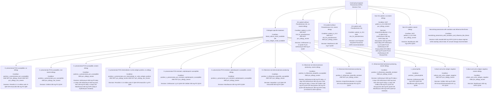

# Community-Acquired Pneumonia (CAP®)
Source: https://www.unboundmedicine.com/ucentral/view/Guidelines%20for%20Antibiotic%20Use/1308079/all/Pneumonia%2C%20CAP

The final decision is

```json
{'is_done': True, 'decision': 'Use Hospital-Acquired Pneumonia (HAP) recommendations', 'path': ['Pathogen-specific treatment', 'ICU patient with Pseudomonas risk']}
```



Raw decision tree json:
```json
{
    "title": "Community-Acquired Pneumonia (CAP®)",
    "indicators": [
        { "name": "blood_culture_result_available", "description": "Whether blood culture results are available at the time of decision-making" },
        { "name": "urine_antigen_result_available", "description": "Whether urine antigen results for S. pneumoniae or Legionella are available at the time of decision-making" },
        { "name": "positive_s_pneumoniae_pcn_susceptible", "description": "Culture result positive for S. pneumoniae PCN susceptible" },
        { "name": "positive_s_pneumoniae_pcn_intermediate_or_urine_antigen_positive", "description": "Culture result showing S. pneumoniae PCN intermediate or urine antigen positive" },
        { "name": "positive_s_pneumoniae_pcn_resistant_cephalosporin_susceptible", "description": "Culture result showing S. pneumoniae PCN resistant but cephalosporin susceptible" },
        { "name": "positive_h_influenzae_ampicillin_susceptible", "description": "Culture result positive for H. influenzae non-beta-lactamase producing" },
        { "name": "positive_h_influenzae_ampicillin_resistant", "description": "Culture result positive for H. influenzae beta-lactamase producing" },
        { "name": "positive_l_pneumophila", "description": "Culture or urine antigen positive for L. pneumophila" },
        { "name": "culture_and_urine_antigen_negative", "description": "Negative culture and urine antigen results" },
        { "name": "pcn_allergy_non_severe", "description": "Patient has a non-severe allergy to penicillin" },
        { "name": "pcn_allergy_severe", "description": "Patient has a severe allergy to penicillin" },
        { "name": "patient_in_ICU", "description": "Patient currently in ICU" },
        { "name": "risk_for_pseudomonas", "description": "Risk factors present for Pseudomonas infection" },
        { "name": "necrotizing_pneumonia_with_cavitation_and_influenza_like_illness", "description": "Necrotizing pneumonia with cavitation and recent influenza-like illness" }
    ],
    "decision_tree": {
        "title": "Community-Acquired Pneumonia (CAP®) Decision Tree",
        "branches": [
            {
                "condition": "blood_culture_result_available OR urine_antigen_result_available",
                "name": "Pathogen-specific treatment",
                "branches": [
                    {
                        "condition": "positive_s_pneumoniae_pcn_susceptible AND NOT pcn_allergy_severe AND NOT pcn_allergy_non_severe",
                        "name": "S. pneumoniae PCN susceptible, no allergy",
                        "decision": "Penicillin G 1.5 million units IV Q6H OR Amoxicillin 500 mg PO Q8H"
                    },
                    {
                        "condition": "positive_s_pneumoniae_pcn_susceptible AND pcn_allergy_non_severe",
                        "name": "S. pneumoniae PCN susceptible, non-severe allergy",
                        "decision": "Cefdinir 300 mg PO Q12H"
                    },
                    {
                        "condition": "positive_s_pneumoniae_pcn_susceptible AND pcn_allergy_severe",
                        "name": "S. pneumoniae PCN susceptible, severe allergy",
                        "decision": "Azithromycin 500 mg PO daily x 3 days OR Azithromycin 500 mg once, then 250 mg PO daily x 4 days OR Moxifloxacin 400 mg IV/PO daily (if erythromycin resistant)"
                    },
                    {
                        "condition": "positive_s_pneumoniae_pcn_intermediate_or_urine_antigen_positive AND NOT pcn_allergy_severe AND NOT pcn_allergy_non_severe",
                        "name": "S. pneumoniae PCN intermediate or urine antigen positive, no allergy",
                        "decision": "Penicillin G 1.5 million units IV Q6H OR Amoxicillin 1 g PO Q8H"
                    },
                    {
                        "condition": "positive_s_pneumoniae_pcn_resistant_cephalosporin_susceptible AND NOT pcn_allergy_severe",
                        "name": "S. pneumoniae PCN resistant, cephalosporin susceptible",
                        "decision": "Ceftriaxone 1 g IV Q24H OR Cefdinir 300 mg PO Q12H"
                    },
                    {
                        "condition": "positive_s_pneumoniae_pcn_resistant_cephalosporin_susceptible AND pcn_allergy_severe",
                        "name": "S. pneumoniae PCN resistant, cephalosporin susceptible, severe allergy",
                        "decision": "Moxifloxacin 400 mg IV/PO Q24H"
                    },
                    {
                        "condition": "positive_h_influenzae_ampicillin_susceptible AND NOT pcn_allergy_severe",
                        "name": "H. influenzae non-beta-lactamase producing",
                        "decision": "Ampicillin 1 g IV Q6H OR Amoxicillin 500 mg PO Q8H"
                    },
                    {
                        "condition": "positive_h_influenzae_ampicillin_susceptible AND pcn_allergy_severe",
                        "name": "H. influenzae non-beta-lactamase producing, severe allergy",
                        "decision": "Azithromycin 500 mg PO daily x 3 days OR Azithromycin 500 mg once, then 250 mg PO daily x 4 days OR Cefdinir 300 mg PO Q12H OR Doxycycline 100 mg PO Q12H OR Moxifloxacin 400 mg IV/PO daily (if resistant to other options)"
                    },
                    {
                        "condition": "positive_h_influenzae_ampicillin_resistant AND NOT pcn_allergy_severe",
                        "name": "H. influenzae beta-lactamase producing",
                        "decision": "Ampicillin/sulbactam 1.5 g Q6H OR Amoxicillin/clavulanate 875 mg PO Q12H"
                    },
                    {
                        "condition": "positive_h_influenzae_ampicillin_resistant AND pcn_allergy_severe",
                        "name": "H. influenzae beta-lactamase producing, severe allergy",
                        "decision": "Azithromycin 500 mg PO daily x 3 days OR Azithromycin 500 mg once, then 250 mg PO daily x 4 days OR Cefdinir 300 mg PO Q12H OR Doxycycline 100 mg PO Q12H OR Moxifloxacin 400 mg IV/PO Q24H (if resistant)"
                    },
                    {
                        "condition": "positive_l_pneumophila",
                        "name": "L. pneumophila",
                        "decision": "Azithromycin 500 mg IV/PO Q24H OR Moxifloxacin 400 mg IV/PO Q24H"
                    },
                    {
                        "condition": "culture_and_urine_antigen_negative AND NOT pcn_allergy_severe",
                        "name": "Culture and urine antigen negative",
                        "decision": "Cefdinir 300 mg PO BID OR Amoxicillin/clavulanate XR 2 g PO Q12H"
                    },
                    {
                        "condition": "culture_and_urine_antigen_negative AND pcn_allergy_severe",
                        "name": "Culture and urine antigen negative, severe allergy",
                        "decision": "Moxifloxacin 400 mg IV/PO Q24H"
                    }
                ]
            },
            {
                "condition": "patient_in_ICU AND NOT risk_for_pseudomonas AND NOT pcn_allergy_severe",
                "name": "ICU patient without Pseudomonas risk, no severe allergy",
                "decision": "Ceftriaxone 1 g IV Q24H PLUS Azithromycin 500 mg IV Q24H"
            },
            {
                "condition": "patient_in_ICU AND NOT risk_for_pseudomonas AND pcn_allergy_severe",
                "name": "ICU patient without Pseudomonas risk, severe allergy",
                "decision": "Moxifloxacin 400 mg IV Q24H"
            },
            {
                "condition": "patient_in_ICU AND risk_for_pseudomonas",
                "name": "ICU patient with Pseudomonas risk",
                "decision": "Use Hospital-Acquired Pneumonia (HAP) recommendations"
            },
            {
                "condition": "NOT patient_in_ICU AND NOT pcn_allergy_severe",
                "name": "Non-ICU patient, no severe allergy",
                "decision": "Ampicillin/sulbactam 1.5 g IV Q6H PLUS (Azithromycin 500 mg IV/PO daily OR Doxycycline 100 mg IV/PO twice daily) OR Ceftriaxone 1 g IV Q24H PLUS (Azithromycin OR Doxycycline) OR Cefdinir 300 mg PO Q12H PLUS (Azithromycin OR Doxycycline)"
            },
            {
                "condition": "NOT patient_in_ICU AND pcn_allergy_severe",
                "name": "Non-ICU patient, severe allergy",
                "decision": "Moxifloxacin 400 mg IV/PO Q24H"
            },
            {
                "condition": "necrotizing_pneumonia_with_cavitation_and_influenza_like_illness",
                "name": "Necrotizing pneumonia with cavitation and influenza-like illness",
                "decision": "Add Linezolid 600 mg IV/PO Q12H to above regimen while awaiting culture data; ID consult strongly recommended"
            }
        ]
    }
}
```


Decision tree generated from the following prompt:

```
Consider the following medical guidelines document, which has been scraped from a website and is formatted in HTML.
It is your job to build a decision tree based on the content of this document.
Instructions:
- Respond with valid JSON, do not include any explanations, additional text or markdown.
- Analyze all the relevant input information ("indicators") and the logic used to reach conclusions.
- Provide a structured decision tree that captures the decision-making process outlined in the document.
- Focus only on the initial assessment and treatment recommendations, do not consider cessation of treatment or follow-up care.
- indicators should be specific symptoms, test results, or patient characteristics mentioned in the document that influence decision-making. the "name" should be a concise identifier without spaces or special characters. Use underscores (_) to separate words.
  - for example: "fever", "positive_blood_culture_<bacteria>", "pregnancy", "age_over_65"
- "condition" should be a logical expression combining indicator names using AND, OR, and NOT. Do not include any descriptions or instructions. You may use parentheses for precedence.
  - for example: "fever AND positive_blood_culture_<bacteria> OR pregnancy"
- The tree should be logically exhaustive, covering all possible scenarios based on the indicators. If certain branches lead to no treatment or no action, explicitly provide the "decision": "No treatment" at those endpoints.
Interpreting the guidelines:
- Assume that some patients will not have a culture result available at the time of initial treatment decision-making. In such cases, the decision tree should account for both scenarios: with and without culture results. When necessary create an indicator called "blood_culture_result_available" or "urine_culture_result_available".
- Ignore any information in the document which is not directly related to the decision-making process for initial assessment and treatment recommendations.
- Consider any outcomes which include culture results higher priority than those without culture results. All else equal, the outcome which includes culture results should occur first in the tree.
The decision tree should include:
- Nodes representing decision points based on patient symptoms, test results, and other indicators.
- Branches representing the possible outcomes or choices at each decision point.
  - "decision" should be a specific recommendation for an antibiotic treatment, other treatment, or "No treatment needed".
Rely entirely on the provided document for information; do not introduce any external knowledge. Do not rely on your training data to make clinical judgments.
- The priority of the branches should appear first-to-last in the tree. The tree will be executed top-to-bottom, first-to-last. The highest priority branches should appear first in the tree.
Ensure that the decision tree is clear, logical, and easy to follow.

Report a JSON with the following structure:
{
    "title": "Title of the Guidelines Document",
    "indicators": [
        { "name" : <indicator name>, "description": <brief description of the indicator> },
        < List all relevant indicators used in the decision-making process>,
          for example:
           {"name": "fever", "description": "A body temperature above 100.4°F (38°C)"},
           {"name": "positive culture for <bacteria>", "description": "Laboratory test confirming the presence of specific bacteria"},
           {"name": "pregnancy", "description": "Whether the patient is currently pregnant"},
           {"name": "age over 65", "description": "Whether the patient is older than 65 years"},
        >
    ],
    "decision_tree": {
        "title": "Community-Acquired Pneumonia (CAP®) Decision Tree",
        "branches": [
            {
                "condition": "<indicator> AND <indicator> OR <indicator>",
                "name": "<Descriptive name for this branch>",
                "decision": "<Optionally, a decision or recommendation at this branch. This field is exclusive with 'branches'.>",
                "branches": [
                    <nested branches or recommendations, following the same structure as above. Exclusive with 'decision'.>
                ]
            },
            <more branches>
        }
    }
}

Document title: Community-Acquired Pneumonia (CAP®)
Document Sections:

<section class="section" data-bodysectionnum="1"><h2 class="section-title" id="pl1"><div>Diagnosis</div></h2><ul style="list-style-type: disc;"><li>Symptoms (cough, shortness of breath, pleuritic chest pain) <b>PLUS</b> oxygen requirement <b>PLUS</b> radiographic infiltrates.</li><li>Sputum and blood cultures should be sent on all patients admitted to the hospital before antibiotics are given.</li><li><i>S. pneumoniae</i> urine antigen should be obtained in all patients with CAP. <ul><li>It has specificity of 96% and positive predictive value of 89–96%.</li><li>It is particularly useful if antibiotics have already been started or cultures cannot be obtained.</li></ul></li><li>The Legionella urine antigen is the test of choice for diagnosing legionella infection. <ul><li>This test detects only <i>L. pneumophila</i> serogroup 1, which is responsible for 70–80% of infections.</li></ul></li><li>Respiratory virus testing should be obtained year round on any patient for whom there is a clinical suspicion of respiratory virus infection. See <a class="doclink" href="./view/Guidelines for Antibiotic Use/1308091/all/Influenza_and_Other_Respiratory_Viruses">influenza and other respiratory viruses</a>.</li></ul></section>

<section class="section" data-bodysectionnum="2"><h2 class="section-title" id="pl2"><div>Microbiology</div></h2><ul style="list-style-type: disc;"><li><i>S. pneumoniae, H. influenza</i></li><li>Atypical: <i>Mycoplasma pneumoniae, Chlamydophila pneumoniae,</i> <i>Legionella pneumophila</i></li><li>Respiratory viruses <ul style="list-style-type: disc;"><li>Can cause primary viral pneumonia as well as lead to bacterial superinfection.</li></ul></li><li>Gram-negatives (occasionally), see risk factors blow.</li><li><i>S. aureus</i> in patients presenting with necrotizing pneumonia with cavitation in absence of risk factors for aspiration, particularly if associated with a preceding or concomitant influenza-like illness.</li></ul></section>

<section class="section" data-bodysectionnum="3"><h2 class="section-title" id="pl3"><div>Treatment</div></h2><a aria-hidden="true" class="section-anchor" name="page3.0"><h2 class="section-title" id="pl3.0"><span class="div"><span class="d2 div">Patient NOT in the ICU</span></span></h2></a><a aria-hidden="true" class="section-anchor" name="3.0"><h2 class="section-title" id="pl3.0"><span class="div"><span class="d2 div">Patient NOT in the ICU</span></span></h2></a><section class="section" data-bodysectionnum="3.0"><h2 class="section-title" id="pl3.0"><div><div class="d2">Patient NOT in the ICU</div></div></h2><ul style="list-style-type: disc;"><li><a class="doclink" href="./view/Guidelines for Antibiotic Use/1308014/all/Ampicillin_sulbactam__Unasyn%C2%AE_">Ampicillin/sulbactam</a> 1.5 g IV Q6H <b>PLUS</b> [<a class="doclink" href="./view/Guidelines for Antibiotic Use/1308015/all/Azithromycin">Azithromycin</a> 500 mg IV/PO once daily <b>OR </b><a class="doclink" href="./view/Guidelines for Antibiotic Use/1308036/all/Doxycycline">Doxycycline</a> 100 mg IV/PO twice daily]*<br/><b>OR</b></li><li><a class="doclink" href="./view/Guidelines for Antibiotic Use/1308026/all/Ceftriaxone">Ceftriaxone</a> 1 g IV Q24H <b>PLUS</b> [<a class="doclink" href="./view/Guidelines for Antibiotic Use/1308015/all/Azithromycin">Azithromycin</a> 500 mg IV/PO once daily <b>OR</b> <a class="doclink" href="./view/Guidelines for Antibiotic Use/1308036/all/Doxycycline">Doxycycline</a> 100 mg IV/PO twice daily]*<br/><b>OR</b></li><li>Cefdinir 300 mg PO Q12H <b>PLUS</b> [<a class="doclink" href="./view/Guidelines for Antibiotic Use/1308015/all/Azithromycin">Azithromycin</a>500 mg PO once daily <b>OR</b> <a class="doclink" href="./view/Guidelines for Antibiotic Use/1308036/all/Doxycycline">Doxycycline</a> 100 mg PO twice daily]*</li></ul><p><b>*Oral therapy is preferred unless the patient is strict NPO</b></p><ul style="list-style-type: disc;"><li>Severe PCN allergy: <a class="doclink" href="./view/Guidelines for Antibiotic Use/1308049/all/Moxifloxacin">Moxifloxacin</a> 400 mg IV/PO Q24H</li><li>In non-critically ill patients, consider switch to oral agents as soon as patient is clinically improving and eating.</li></ul></section><a aria-hidden="true" class="section-anchor" name="page3.1"><h2 class="section-title" id="pl3.1"><span class="div"><span class="d2 div">Patient in the ICU</span></span></h2></a><a aria-hidden="true" class="section-anchor" name="3.1"><h2 class="section-title" id="pl3.1"><span class="div"><span class="d2 div">Patient in the ICU</span></span></h2></a><section class="section" data-bodysectionnum="3.1"><h2 class="section-title" id="pl3.1"><div><div class="d2">Patient in the ICU</div></div></h2><p><b>Not at risk for infection with <i>Pseudomonas </i></b><span style="line-height: 1.4em; text-indent: 0em;">(see risk factors below) </span></p><ul style="list-style-type: disc;"><li><a class="doclink" href="./view/Guidelines for Antibiotic Use/1308026/all/Ceftriaxone">Ceftriaxone</a> 1 g IV Q24H <b>PLUS</b> <a class="doclink" href="./view/Guidelines for Antibiotic Use/1308015/all/Azithromycin">Azithromycin</a> 500 mg IV Q24H<br/><b>OR</b></li><li>Severe PCN allergy: <a class="doclink" href="./view/Guidelines for Antibiotic Use/1308049/all/Moxifloxacin">Moxifloxacin</a> 400 mg IV Q24H</li></ul><p><b>For patients coming from the community with risk for <i>Pseudomonas</i> infection, use <a class="doclink" href="./view/Guidelines for Antibiotic Use/1308089/all/Hospital_Acquired_Pneumonia__HAP%C2%AE_">HAP</a> recommendations. </b></p><ul><li>Bronchiectasis, structural lung disease</li><li>Broad-spectrum antibiotics for &gt; 7 days in the past month</li><li>Prolonged hospitalization &gt; 7 days within the past 3 months</li><li>Admitted from or resided in nursing home or skilled nursing facility within the past 3 months</li><li>Recent mechanical ventilation &gt; 48 hours</li><li>Immunocompromise due to solid organ transplant, hematologic malignancy, BMT, active chemotherapy, prednisone &gt; 20 mg daily for &gt; 3 weeks.</li></ul></section><a aria-hidden="true" class="section-anchor" name="page3.2"><h2 class="section-title" id="pl3.2"><span class="div"><span class="d2 div">When to Cover MRSA</span></span></h2></a><a aria-hidden="true" class="section-anchor" name="3.2"><h2 class="section-title" id="pl3.2"><span class="div"><span class="d2 div">When to Cover MRSA</span></span></h2></a><section class="section" data-bodysectionnum="3.2"><h2 class="section-title" id="pl3.2"><div><div class="d2">When to Cover MRSA</div></div></h2><ul style="list-style-type: disc;"><li>Patients presenting with necrotizing pneumonia with cavitation in absence of risk factors for aspiration, particularly if associated with a preceding or concomitant influenza-like illness should be covered for CA-MRSA.</li></ul><ul style="list-style-type: disc;"><li><a class="doclink" href="./view/Guidelines for Antibiotic Use/1308045/all/Linezolid">Linezolid</a> 600 mg IV/PO Q12H can be added to the above regimens while awaiting culture data. ID consult is strongly recommended.</li><li><b>Use of Linezolid monotherapy for MRSA bacteremia, even if associated with a pulmonary source, is NOT recommended. </b>If patient is bacteremic with pneumonia consult ID.</li><li>In the absence of necrotizing pneumonia with cavitation, empiric coverage for CA-MRSA can be deferred until sputum and blood culture results return given their high diagnostic yield for CA-MRSA.</li></ul></section><a aria-hidden="true" class="section-anchor" name="page3.3"><h2 class="section-title" id="pl3.3"><span class="div"><span class="d2 div">Pathogen-Specific</span></span></h2></a><a aria-hidden="true" class="section-anchor" name="3.3"><h2 class="section-title" id="pl3.3"><span class="div"><span class="d2 div">Pathogen-Specific</span></span></h2></a><section class="section" data-bodysectionnum="3.3"><h2 class="section-title" id="pl3.3"><div><div class="d2">Pathogen-Specific</div></div></h2><div class="table-container"><div class="table-container1"><div class="mock-table"></div></div><div class="table-container2"><table border="1" class="data" id="d1643e4" summary="Table"><thead><tr> <td><p><b>Organism </b></p></td> <td><p><b>Preferred therapy </b></p></td> <td><p><b>PCN allergy </b></p></td> <td><p><b>Notes </b></p></td> </tr></thead><tfoot><tr> <td colspan="4"><p>* If Erythromycin susceptible</p><p>† If Tetracycline susceptible</p><p>‡ Unless strong suspicion for <i>L. pneumophila</i>, more than 3 days of Azithromycin for atypical coverage is not needed due to very long half-life in lung tissue</p></td> </tr></tfoot><tr> <td><p><i>S. pneumoniae</i> PCN susceptible</p></td> <td><p><a class="doclink" href="./view/Guidelines for Antibiotic Use/1308054/all/Penicillin_V_G">Penicillin G</a> 1.5 million units IV Q6H<br/><b>OR <br/></b><a class="doclink" href="./view/Guidelines for Antibiotic Use/1308010/all/Amoxicillin">Amoxicillin</a> 500 mg PO Q8H</p></td> <td><p><b>Non-severe reaction: </b><a class="doclink" href="./view/Guidelines for Antibiotic Use/1308020/all/Cefdinir">Cefdinir</a> 300 mg PO Q12H</p><p><b>Severe reaction: <br/></b><a class="doclink" href="./view/Guidelines for Antibiotic Use/1308015/all/Azithromycin">Azithromycin</a>* [500 mg PO daily X 3 days <b>OR</b> 500 mg once, then 250 mg PO daily X 4 days]<br/><b>OR<br/></b><a class="doclink" href="./view/Guidelines for Antibiotic Use/1308049/all/Moxifloxacin">Moxifloxacin</a> 400 mg IV/PO daily (if Erythromycin resistant)</p></td> <td><p>98% of <i>S. pneumoniae</i> isolates at JHH are susceptible, 2% are intermediate, and 0% are resistant to PCN, 51% are susceptible to Erythromycin (Erythromycin susceptibilities predict Azithromycin susceptibilities for <i>S. pneumoniae</i>), and 100% are susceptible to Ceftriaxone and Moxifloxacin</p></td> </tr><tr> <td><p><i>S. pneumoniae</i> PCN intermediate or urine antigen positive</p></td> <td><p><a class="doclink" href="./view/Guidelines for Antibiotic Use/1308054/all/Penicillin_V_G">Penicillin G</a> 1.5 million units IV Q6H<br/><b>OR<br/></b><a class="doclink" href="./view/Guidelines for Antibiotic Use/1308010/all/Amoxicillin">Amoxicillin</a> 1 g PO Q8H</p></td> <td><p>Same as above</p></td> <td> </td> </tr><tr> <td><p><i>S. pneumoniae </i>PCN resistant, cephalosporin susceptible</p></td> <td><p><a class="doclink" href="./view/Guidelines for Antibiotic Use/1308026/all/Ceftriaxone">Ceftriaxone</a> 1 g IV Q24<br/><b>OR <br/></b><a class="doclink" href="./view/Guidelines for Antibiotic Use/1308020/all/Cefdinir">Cefdinir</a> 300 mg PO Q12H</p></td> <td><p><a class="doclink" href="./view/Guidelines for Antibiotic Use/1308049/all/Moxifloxacin">Moxifloxacin</a> 400 mg IV/PO Q24H</p></td> <td> </td> </tr><tr> <td><p><i>H. influenzae </i>non-beta-lactamase producing (Ampicillin susceptible)</p></td> <td><p><a class="doclink" href="./view/Guidelines for Antibiotic Use/1308013/all/Ampicillin">Ampicillin</a> 1 g IV Q6H<br/><b>OR<br/></b><a class="doclink" href="./view/Guidelines for Antibiotic Use/1308010/all/Amoxicillin">Amoxicillin</a> 500 mg PO Q8H</p></td> <td><p><a class="doclink" href="./view/Guidelines for Antibiotic Use/1308015/all/Azithromycin">Azithromycin</a>* [500 mg PO daily X 3 days <b>OR</b> 500 mg once, then 250 mg PO daily X 4 days]<br/><b>OR<br/></b><a class="doclink" href="./view/Guidelines for Antibiotic Use/1308020/all/Cefdinir">Cefdinir</a> 300 mg PO Q12H<br/><b>OR <br/></b><a class="doclink" href="./view/Guidelines for Antibiotic Use/1308036/all/Doxycycline">Doxycycline</a>† 100 mg PO Q12H<br/><b>OR<br/></b><a class="doclink" href="./view/Guidelines for Antibiotic Use/1308049/all/Moxifloxacin">Moxifloxacin</a> 400 mg IV/PO daily (if resistant to other options)</p></td> <td><p>58% of <i>H. influenzae</i> isolates at JHH are susceptible to Ampicillin, 100% to Ceftriaxone, 90% to Tetracycline, and 100% to Moxifloxacin</p></td> </tr><tr> <td><p><i>H. influenzae</i> beta-lactamase producing (Ampicillin resistant)</p></td> <td><p><a class="doclink" href="./view/Guidelines for Antibiotic Use/1308014/all/Ampicillin_sulbactam__Unasyn%C2%AE_">Ampicillin/sulbactam</a> 1.5 g Q6H<br/><b>OR<br/></b><a class="doclink" href="./view/Guidelines for Antibiotic Use/1308011/all/Amoxicillin_clavulanate__Augmentin%C2%AE_">Amoxicillin/clavulanate</a> 875 mg PO Q12H</p></td> <td><p><a class="doclink" href="./view/Guidelines for Antibiotic Use/1308015/all/Azithromycin">Azithromycin</a>* [500 mg PO daily X 3 days <b>OR</b> 500 mg once, then 250 mg PO daily X 4 days]<br/><b>OR<br/></b><a class="doclink" href="./view/Guidelines for Antibiotic Use/1308020/all/Cefdinir">Cefdinir</a> 300 mg PO Q12H<br/><b>OR<br/></b><a class="doclink" href="./view/Guidelines for Antibiotic Use/1308036/all/Doxycycline">Doxycycline</a>† 100 mg PO Q12H<br/><b>OR<br/></b><a class="doclink" href="./view/Guidelines for Antibiotic Use/1308049/all/Moxifloxacin">Moxifloxacin</a> 400 mg IV/PO Q24H (if resistant to other options)</p></td> <td> </td> </tr><tr> <td><p><i>L. pneumophlia</i></p></td> <td><p><a class="doclink" href="./view/Guidelines for Antibiotic Use/1308015/all/Azithromycin">Azithromycin</a> 500 mg IV/PO Q24H<br/><b>OR<br/></b><a class="doclink" href="./view/Guidelines for Antibiotic Use/1308049/all/Moxifloxacin">Moxifloxacin</a> 400 mg IV/PO Q24H</p></td> <td><p><a class="doclink" href="./view/Guidelines for Antibiotic Use/1308015/all/Azithromycin">Azithromycin</a> 500 mg IV/PO Q24H x 7-10 days<br/><b>OR<br/></b><a class="doclink" href="./view/Guidelines for Antibiotic Use/1308049/all/Moxifloxacin">Moxifloxacin</a> 400 mg IV/PO Q24H X 10-14 days</p></td> <td> </td> </tr><tr> <td><p>Culture and urine antigen negative‡</p></td> <td><p><a class="doclink" href="./view/Guidelines for Antibiotic Use/1308020/all/Cefdinir">Cefdinir</a> 300 mg PO BID<br/><b>OR<br/></b><a class="doclink" href="./view/Guidelines for Antibiotic Use/1308011/all/Amoxicillin_clavulanate__Augmentin%C2%AE_">Amoxicillin/clavulanate</a> XR 2 g PO Q12H</p></td> <td><p><a class="doclink" href="./view/Guidelines for Antibiotic Use/1308049/all/Moxifloxacin">Moxifloxacin</a> 400 mg IV/PO Q24H</p></td> <td><p>51% of <i>S. pneumoniae</i> isolates at JHH are susceptible to Erythromycin (Erythromycin susceptibilities predict Azithromycin susceptibilities for <i>S. pneumoniae</i>), therefore Azithromycin is suboptimal for empiric step-down therapy</p></td> </tr></table></div></div></section></section>

<section class="section" data-bodysectionnum="3.0"><h2 class="section-title" id="pl3.0"><div><div class="d2">Patient NOT in the ICU</div></div></h2><ul style="list-style-type: disc;"><li><a class="doclink" href="./view/Guidelines for Antibiotic Use/1308014/all/Ampicillin_sulbactam__Unasyn%C2%AE_">Ampicillin/sulbactam</a> 1.5 g IV Q6H <b>PLUS</b> [<a class="doclink" href="./view/Guidelines for Antibiotic Use/1308015/all/Azithromycin">Azithromycin</a> 500 mg IV/PO once daily <b>OR </b><a class="doclink" href="./view/Guidelines for Antibiotic Use/1308036/all/Doxycycline">Doxycycline</a> 100 mg IV/PO twice daily]*<br/><b>OR</b></li><li><a class="doclink" href="./view/Guidelines for Antibiotic Use/1308026/all/Ceftriaxone">Ceftriaxone</a> 1 g IV Q24H <b>PLUS</b> [<a class="doclink" href="./view/Guidelines for Antibiotic Use/1308015/all/Azithromycin">Azithromycin</a> 500 mg IV/PO once daily <b>OR</b> <a class="doclink" href="./view/Guidelines for Antibiotic Use/1308036/all/Doxycycline">Doxycycline</a> 100 mg IV/PO twice daily]*<br/><b>OR</b></li><li>Cefdinir 300 mg PO Q12H <b>PLUS</b> [<a class="doclink" href="./view/Guidelines for Antibiotic Use/1308015/all/Azithromycin">Azithromycin</a>500 mg PO once daily <b>OR</b> <a class="doclink" href="./view/Guidelines for Antibiotic Use/1308036/all/Doxycycline">Doxycycline</a> 100 mg PO twice daily]*</li></ul><p><b>*Oral therapy is preferred unless the patient is strict NPO</b></p><ul style="list-style-type: disc;"><li>Severe PCN allergy: <a class="doclink" href="./view/Guidelines for Antibiotic Use/1308049/all/Moxifloxacin">Moxifloxacin</a> 400 mg IV/PO Q24H</li><li>In non-critically ill patients, consider switch to oral agents as soon as patient is clinically improving and eating.</li></ul></section>

<section class="section" data-bodysectionnum="3.1"><h2 class="section-title" id="pl3.1"><div><div class="d2">Patient in the ICU</div></div></h2><p><b>Not at risk for infection with <i>Pseudomonas </i></b><span style="line-height: 1.4em; text-indent: 0em;">(see risk factors below) </span></p><ul style="list-style-type: disc;"><li><a class="doclink" href="./view/Guidelines for Antibiotic Use/1308026/all/Ceftriaxone">Ceftriaxone</a> 1 g IV Q24H <b>PLUS</b> <a class="doclink" href="./view/Guidelines for Antibiotic Use/1308015/all/Azithromycin">Azithromycin</a> 500 mg IV Q24H<br/><b>OR</b></li><li>Severe PCN allergy: <a class="doclink" href="./view/Guidelines for Antibiotic Use/1308049/all/Moxifloxacin">Moxifloxacin</a> 400 mg IV Q24H</li></ul><p><b>For patients coming from the community with risk for <i>Pseudomonas</i> infection, use <a class="doclink" href="./view/Guidelines for Antibiotic Use/1308089/all/Hospital_Acquired_Pneumonia__HAP%C2%AE_">HAP</a> recommendations. </b></p><ul><li>Bronchiectasis, structural lung disease</li><li>Broad-spectrum antibiotics for &gt; 7 days in the past month</li><li>Prolonged hospitalization &gt; 7 days within the past 3 months</li><li>Admitted from or resided in nursing home or skilled nursing facility within the past 3 months</li><li>Recent mechanical ventilation &gt; 48 hours</li><li>Immunocompromise due to solid organ transplant, hematologic malignancy, BMT, active chemotherapy, prednisone &gt; 20 mg daily for &gt; 3 weeks.</li></ul></section>

<section class="section" data-bodysectionnum="3.2"><h2 class="section-title" id="pl3.2"><div><div class="d2">When to Cover MRSA</div></div></h2><ul style="list-style-type: disc;"><li>Patients presenting with necrotizing pneumonia with cavitation in absence of risk factors for aspiration, particularly if associated with a preceding or concomitant influenza-like illness should be covered for CA-MRSA.</li></ul><ul style="list-style-type: disc;"><li><a class="doclink" href="./view/Guidelines for Antibiotic Use/1308045/all/Linezolid">Linezolid</a> 600 mg IV/PO Q12H can be added to the above regimens while awaiting culture data. ID consult is strongly recommended.</li><li><b>Use of Linezolid monotherapy for MRSA bacteremia, even if associated with a pulmonary source, is NOT recommended. </b>If patient is bacteremic with pneumonia consult ID.</li><li>In the absence of necrotizing pneumonia with cavitation, empiric coverage for CA-MRSA can be deferred until sputum and blood culture results return given their high diagnostic yield for CA-MRSA.</li></ul></section>

<section class="section" data-bodysectionnum="3.3"><h2 class="section-title" id="pl3.3"><div><div class="d2">Pathogen-Specific</div></div></h2><div class="table-container"><div class="table-container1"><div class="mock-table"></div></div><div class="table-container2"><table border="1" class="data" id="d1643e4" summary="Table"><thead><tr> <td><p><b>Organism </b></p></td> <td><p><b>Preferred therapy </b></p></td> <td><p><b>PCN allergy </b></p></td> <td><p><b>Notes </b></p></td> </tr></thead><tfoot><tr> <td colspan="4"><p>* If Erythromycin susceptible</p><p>† If Tetracycline susceptible</p><p>‡ Unless strong suspicion for <i>L. pneumophila</i>, more than 3 days of Azithromycin for atypical coverage is not needed due to very long half-life in lung tissue</p></td> </tr></tfoot><tr> <td><p><i>S. pneumoniae</i> PCN susceptible</p></td> <td><p><a class="doclink" href="./view/Guidelines for Antibiotic Use/1308054/all/Penicillin_V_G">Penicillin G</a> 1.5 million units IV Q6H<br/><b>OR <br/></b><a class="doclink" href="./view/Guidelines for Antibiotic Use/1308010/all/Amoxicillin">Amoxicillin</a> 500 mg PO Q8H</p></td> <td><p><b>Non-severe reaction: </b><a class="doclink" href="./view/Guidelines for Antibiotic Use/1308020/all/Cefdinir">Cefdinir</a> 300 mg PO Q12H</p><p><b>Severe reaction: <br/></b><a class="doclink" href="./view/Guidelines for Antibiotic Use/1308015/all/Azithromycin">Azithromycin</a>* [500 mg PO daily X 3 days <b>OR</b> 500 mg once, then 250 mg PO daily X 4 days]<br/><b>OR<br/></b><a class="doclink" href="./view/Guidelines for Antibiotic Use/1308049/all/Moxifloxacin">Moxifloxacin</a> 400 mg IV/PO daily (if Erythromycin resistant)</p></td> <td><p>98% of <i>S. pneumoniae</i> isolates at JHH are susceptible, 2% are intermediate, and 0% are resistant to PCN, 51% are susceptible to Erythromycin (Erythromycin susceptibilities predict Azithromycin susceptibilities for <i>S. pneumoniae</i>), and 100% are susceptible to Ceftriaxone and Moxifloxacin</p></td> </tr><tr> <td><p><i>S. pneumoniae</i> PCN intermediate or urine antigen positive</p></td> <td><p><a class="doclink" href="./view/Guidelines for Antibiotic Use/1308054/all/Penicillin_V_G">Penicillin G</a> 1.5 million units IV Q6H<br/><b>OR<br/></b><a class="doclink" href="./view/Guidelines for Antibiotic Use/1308010/all/Amoxicillin">Amoxicillin</a> 1 g PO Q8H</p></td> <td><p>Same as above</p></td> <td> </td> </tr><tr> <td><p><i>S. pneumoniae </i>PCN resistant, cephalosporin susceptible</p></td> <td><p><a class="doclink" href="./view/Guidelines for Antibiotic Use/1308026/all/Ceftriaxone">Ceftriaxone</a> 1 g IV Q24<br/><b>OR <br/></b><a class="doclink" href="./view/Guidelines for Antibiotic Use/1308020/all/Cefdinir">Cefdinir</a> 300 mg PO Q12H</p></td> <td><p><a class="doclink" href="./view/Guidelines for Antibiotic Use/1308049/all/Moxifloxacin">Moxifloxacin</a> 400 mg IV/PO Q24H</p></td> <td> </td> </tr><tr> <td><p><i>H. influenzae </i>non-beta-lactamase producing (Ampicillin susceptible)</p></td> <td><p><a class="doclink" href="./view/Guidelines for Antibiotic Use/1308013/all/Ampicillin">Ampicillin</a> 1 g IV Q6H<br/><b>OR<br/></b><a class="doclink" href="./view/Guidelines for Antibiotic Use/1308010/all/Amoxicillin">Amoxicillin</a> 500 mg PO Q8H</p></td> <td><p><a class="doclink" href="./view/Guidelines for Antibiotic Use/1308015/all/Azithromycin">Azithromycin</a>* [500 mg PO daily X 3 days <b>OR</b> 500 mg once, then 250 mg PO daily X 4 days]<br/><b>OR<br/></b><a class="doclink" href="./view/Guidelines for Antibiotic Use/1308020/all/Cefdinir">Cefdinir</a> 300 mg PO Q12H<br/><b>OR <br/></b><a class="doclink" href="./view/Guidelines for Antibiotic Use/1308036/all/Doxycycline">Doxycycline</a>† 100 mg PO Q12H<br/><b>OR<br/></b><a class="doclink" href="./view/Guidelines for Antibiotic Use/1308049/all/Moxifloxacin">Moxifloxacin</a> 400 mg IV/PO daily (if resistant to other options)</p></td> <td><p>58% of <i>H. influenzae</i> isolates at JHH are susceptible to Ampicillin, 100% to Ceftriaxone, 90% to Tetracycline, and 100% to Moxifloxacin</p></td> </tr><tr> <td><p><i>H. influenzae</i> beta-lactamase producing (Ampicillin resistant)</p></td> <td><p><a class="doclink" href="./view/Guidelines for Antibiotic Use/1308014/all/Ampicillin_sulbactam__Unasyn%C2%AE_">Ampicillin/sulbactam</a> 1.5 g Q6H<br/><b>OR<br/></b><a class="doclink" href="./view/Guidelines for Antibiotic Use/1308011/all/Amoxicillin_clavulanate__Augmentin%C2%AE_">Amoxicillin/clavulanate</a> 875 mg PO Q12H</p></td> <td><p><a class="doclink" href="./view/Guidelines for Antibiotic Use/1308015/all/Azithromycin">Azithromycin</a>* [500 mg PO daily X 3 days <b>OR</b> 500 mg once, then 250 mg PO daily X 4 days]<br/><b>OR<br/></b><a class="doclink" href="./view/Guidelines for Antibiotic Use/1308020/all/Cefdinir">Cefdinir</a> 300 mg PO Q12H<br/><b>OR<br/></b><a class="doclink" href="./view/Guidelines for Antibiotic Use/1308036/all/Doxycycline">Doxycycline</a>† 100 mg PO Q12H<br/><b>OR<br/></b><a class="doclink" href="./view/Guidelines for Antibiotic Use/1308049/all/Moxifloxacin">Moxifloxacin</a> 400 mg IV/PO Q24H (if resistant to other options)</p></td> <td> </td> </tr><tr> <td><p><i>L. pneumophlia</i></p></td> <td><p><a class="doclink" href="./view/Guidelines for Antibiotic Use/1308015/all/Azithromycin">Azithromycin</a> 500 mg IV/PO Q24H<br/><b>OR<br/></b><a class="doclink" href="./view/Guidelines for Antibiotic Use/1308049/all/Moxifloxacin">Moxifloxacin</a> 400 mg IV/PO Q24H</p></td> <td><p><a class="doclink" href="./view/Guidelines for Antibiotic Use/1308015/all/Azithromycin">Azithromycin</a> 500 mg IV/PO Q24H x 7-10 days<br/><b>OR<br/></b><a class="doclink" href="./view/Guidelines for Antibiotic Use/1308049/all/Moxifloxacin">Moxifloxacin</a> 400 mg IV/PO Q24H X 10-14 days</p></td> <td> </td> </tr><tr> <td><p>Culture and urine antigen negative‡</p></td> <td><p><a class="doclink" href="./view/Guidelines for Antibiotic Use/1308020/all/Cefdinir">Cefdinir</a> 300 mg PO BID<br/><b>OR<br/></b><a class="doclink" href="./view/Guidelines for Antibiotic Use/1308011/all/Amoxicillin_clavulanate__Augmentin%C2%AE_">Amoxicillin/clavulanate</a> XR 2 g PO Q12H</p></td> <td><p><a class="doclink" href="./view/Guidelines for Antibiotic Use/1308049/all/Moxifloxacin">Moxifloxacin</a> 400 mg IV/PO Q24H</p></td> <td><p>51% of <i>S. pneumoniae</i> isolates at JHH are susceptible to Erythromycin (Erythromycin susceptibilities predict Azithromycin susceptibilities for <i>S. pneumoniae</i>), therefore Azithromycin is suboptimal for empiric step-down therapy</p></td> </tr></table></div></div></section>

<section class="section" data-bodysectionnum="4"><h2 class="section-title" id="pl4"><div>Treatment Duration</div></h2><p><b>Therapy can be stopped after the patient is:</b></p><ul style="list-style-type: disc;"><li>Afebrile for 48–72 hours<br/><b>AND</b></li><li>Has no more than one of the following signs and symptoms: HR &gt; 100 beats/min, RR &gt; 24 breaths/min, BP &lt; 90 mmHg, O<sub>2</sub> sat &lt; 90%, altered mental status.</li></ul><p><b>Suggested duration of therapy based on patient specific factors:</b></p><ul style="list-style-type: disc;"><li><b>3–5 days</b>: Patient without immunocompromise or structural lung disease</li><li><b>7 days</b>: Patients with moderate immunocompromise and/or structural lung disease</li><li><b>10–14 days</b>: Patients with poor clinical response, who received initial inappropriate therapy, or who are significantly immunocompromised</li></ul><ul style="list-style-type: disc;"><li><b>Azithromycin</b> has a large volume of distribution and prolonged half-life in the lungs, <b>therefore 3 days of therapy provides coverage for ≥ 8 days.</b></li></ul></section>

<section class="section" data-bodysectionnum="5"><h2 class="section-title" id="pl5"><div>Management</div></h2><ul style="list-style-type: disc;"><li><span style="line-height: 14px;">For uncomplicated bacteremic pneumococcal pneumonia, prolonged course of antibiotic therapy is not necessary, treat as pneumonia.</span></li><li>Cough and chest X-ray abnormalities may take 4–6 weeks to improve.</li><li>There is NO need to extend antibiotics if the patient is doing well otherwise (e.g., has no fever)</li></ul></section>

```
